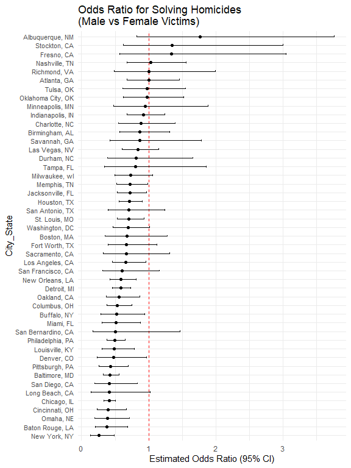
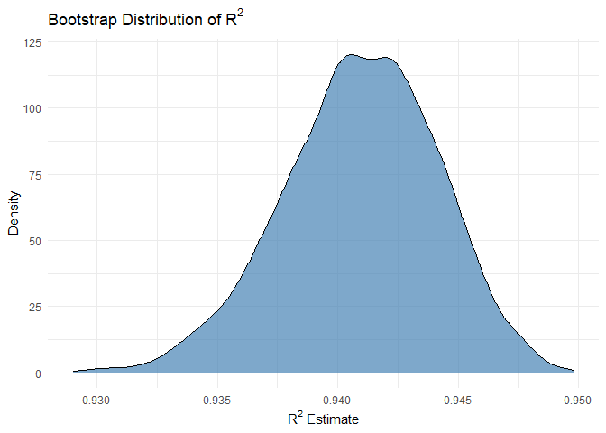
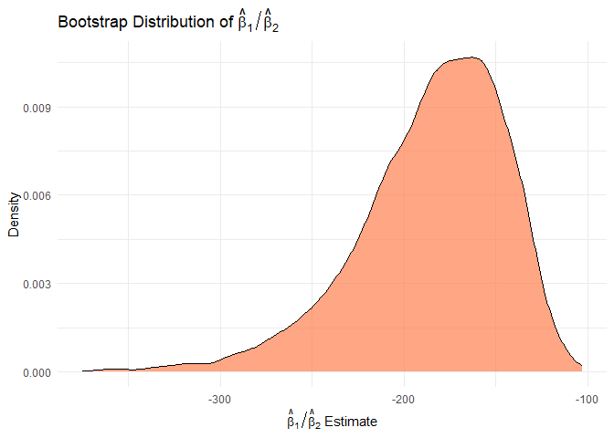

HW6
================
Rene Chi
2025-11-24

## Loading necesscary packages

``` r
library(tidyverse)
library(p8105.datasets)
library(ggplot2)
library(broom)
```

## Problem 1

``` r
# Cleaning data
homicide_df =
  read_csv("hw6 data/homicide-data.csv") |> 
  mutate(
    victim_age = na_if(victim_age, "Unknown"),
    victim_age = as.numeric(victim_age),
    city_state = str_c(city, state, sep = ", ")
  ) |> 
  filter(victim_race == "White" | victim_race == "Black") |> 
  filter(!(city_state == "Dallas, TX" | city_state == "Phoenix, AZ"
           | city_state == "Kansas City, MO" | city_state == "Tulsa, AL"))

# city unsolved case counting
city_summary =
  homicide_df |>
  mutate(
    case_resolved = if_else(disposition == "Closed by arrest",
                            true = 1, false = 0)
  )

# Baltimore glm test
baltimore_summary =
  city_summary |> 
  filter(city_state == "Baltimore, MD")

baltimore_glm_test =
  glm(case_resolved ~ victim_age + victim_race +
        victim_sex, data = baltimore_summary, family = binomial)

# tidy baltimore results
baltimore_result =
  broom::tidy(baltimore_glm_test, exponentiate = TRUE, conf.int = TRUE) |> 
  filter(term == "victim_sexMale") |> 
  select(estimate, conf.low, conf.high)

knitr::kable(baltimore_result)
```

|  estimate |  conf.low | conf.high |
|----------:|----------:|----------:|
| 0.4255117 | 0.3241908 | 0.5575508 |

``` r
# Setting up the function
fit_logistic_model =
  function(df) {
  glm(case_resolved ~ victim_age + victim_race + victim_sex, 
      data = df, 
      family = binomial) |> 
    broom::tidy(exponentiate = TRUE, conf.int = TRUE)
}

# Run the function on all cities
city_results =
  city_summary |>
  nest(data = -city_state) |> 
  mutate(model_results = map(data, fit_logistic_model)) |> 
  unnest(model_results) |> 
  filter(term == "victim_sexMale") |> 
  select(city_state, estimate, conf.low, conf.high)

knitr::kable(city_results)
```

| city_state         |  estimate |  conf.low | conf.high |
|:-------------------|----------:|----------:|----------:|
| Albuquerque, NM    | 1.7674995 | 0.8247081 | 3.7618600 |
| Atlanta, GA        | 1.0000771 | 0.6803477 | 1.4582575 |
| Baltimore, MD      | 0.4255117 | 0.3241908 | 0.5575508 |
| Baton Rouge, LA    | 0.3814393 | 0.2043481 | 0.6836343 |
| Birmingham, AL     | 0.8700153 | 0.5713814 | 1.3138409 |
| Boston, MA         | 0.6739912 | 0.3534469 | 1.2768225 |
| Buffalo, NY        | 0.5205704 | 0.2884416 | 0.9358300 |
| Charlotte, NC      | 0.8838976 | 0.5507440 | 1.3905954 |
| Chicago, IL        | 0.4100982 | 0.3361233 | 0.5008546 |
| Cincinnati, OH     | 0.3998277 | 0.2313767 | 0.6670456 |
| Columbus, OH       | 0.5324845 | 0.3770457 | 0.7479124 |
| Denver, CO         | 0.4790620 | 0.2327380 | 0.9624974 |
| Detroit, MI        | 0.5823472 | 0.4619454 | 0.7335458 |
| Durham, NC         | 0.8123514 | 0.3824420 | 1.6580169 |
| Fort Worth, TX     | 0.6689803 | 0.3935128 | 1.1211603 |
| Fresno, CA         | 1.3351647 | 0.5672553 | 3.0475080 |
| Houston, TX        | 0.7110264 | 0.5569844 | 0.9057376 |
| Indianapolis, IN   | 0.9187284 | 0.6784616 | 1.2413059 |
| Jacksonville, FL   | 0.7198144 | 0.5359236 | 0.9650986 |
| Las Vegas, NV      | 0.8373078 | 0.6058830 | 1.1510854 |
| Long Beach, CA     | 0.4102163 | 0.1427304 | 1.0241775 |
| Los Angeles, CA    | 0.6618816 | 0.4565014 | 0.9541036 |
| Louisville, KY     | 0.4905546 | 0.3014879 | 0.7836391 |
| Memphis, TN        | 0.7232194 | 0.5261210 | 0.9835973 |
| Miami, FL          | 0.5152379 | 0.3040214 | 0.8734480 |
| Milwaukee, wI      | 0.7271327 | 0.4951325 | 1.0542297 |
| Minneapolis, MN    | 0.9469587 | 0.4759016 | 1.8809745 |
| Nashville, TN      | 1.0342379 | 0.6807452 | 1.5559966 |
| New Orleans, LA    | 0.5849373 | 0.4218807 | 0.8121787 |
| New York, NY       | 0.2623978 | 0.1327512 | 0.4850117 |
| Oakland, CA        | 0.5630819 | 0.3637421 | 0.8671086 |
| Oklahoma City, OK  | 0.9740747 | 0.6228507 | 1.5199721 |
| Omaha, NE          | 0.3824861 | 0.1988357 | 0.7109316 |
| Philadelphia, PA   | 0.4962756 | 0.3760120 | 0.6498797 |
| Pittsburgh, PA     | 0.4307528 | 0.2626022 | 0.6955518 |
| Richmond, VA       | 1.0060520 | 0.4834671 | 1.9936248 |
| San Antonio, TX    | 0.7046200 | 0.3928179 | 1.2382509 |
| Sacramento, CA     | 0.6688418 | 0.3262733 | 1.3143888 |
| Savannah, GA       | 0.8669817 | 0.4185827 | 1.7802453 |
| San Bernardino, CA | 0.5003444 | 0.1655367 | 1.4623977 |
| San Diego, CA      | 0.4130248 | 0.1913527 | 0.8301847 |
| San Francisco, CA  | 0.6075362 | 0.3116925 | 1.1551470 |
| St. Louis, MO      | 0.7031665 | 0.5298505 | 0.9319005 |
| Stockton, CA       | 1.3517273 | 0.6256427 | 2.9941299 |
| Tampa, FL          | 0.8077029 | 0.3395253 | 1.8598834 |
| Tulsa, OK          | 0.9757694 | 0.6090664 | 1.5439356 |
| Washington, DC     | 0.6901713 | 0.4653608 | 1.0122516 |

``` r
# Plot
city_results |>
  mutate(city_state = fct_reorder(city_state, estimate)) |>
  ggplot(aes(x = city_state, y = estimate)) +
  geom_hline(yintercept = 1, linetype = "dashed", color = "red") +
  geom_errorbar(aes(ymin = conf.low, ymax = conf.high), width = 0.2) +
  geom_point() +
  coord_flip() +
  labs(
    title = "Odds Ratio for Solving Homicides \n(Male vs Female Victims)",
    x = "City_State",
    y = "Estimated Odds Ratio (95% CI)"
  ) +
  theme_minimal() +
  theme(axis.text.y = element_text(size = 8))
```

<!-- -->

According to the plot, Albuquerque city has the highest Odds Ratio with
the widest C.I, while New York City has the lowest Odds Ratio, with
Chicago city having the tightest C.I.

## Problem 2

``` r
data("weather_df")

get_estimates = function(data) {
  boot_sample = data |> 
    slice_sample(prop = 1, replace = TRUE)
  
  fit = lm(tmax ~ tmin + prcp, data = boot_sample)

  r_squared = glance(fit) |> 
    pull(r.squared)

  coeffs = broom::tidy(fit)
  
  # Extract beta_1 (tmin) and beta_2 (prcp)
  beta_1 = coeffs |> 
    filter(term == "tmin") |> 
    pull(estimate)
  
  beta_2 = coeffs |> 
    filter(term == "prcp") %>%
    pull(estimate)
  
  # Calculate the ratio
  beta_ratio = beta_1 / beta_2
  
  # Return the results as a named list or data frame row
  tibble(
    r_squared = r_squared,
    beta_ratio = beta_ratio
  )
}

# Set seed for reproducibility
set.seed(20251125)

# Perform 5000 bootstrap iterations
bootstrap_results =
  map(1:5000, ~ get_estimates(weather_df)) |> 
  list_rbind() 

# Plotting
bootstrap_results |> 
  ggplot(aes(x = r_squared)) +
  geom_density(fill = "steelblue", alpha = 0.7) +
  labs(
    title = expression("Bootstrap Distribution of" ~ R^2),
    x = expression(R^2 ~ "Estimate"),
    y = "Density"
  ) +
  theme_minimal()
```

<!-- -->

``` r
bootstrap_results |> 
  ggplot(aes(x = beta_ratio)) +
  geom_density(fill = "coral", alpha = 0.7) +
  labs(
    title = expression("Bootstrap Distribution of" ~ hat(beta)[1] / hat(beta)[2]),
    x = expression(hat(beta)[1] / hat(beta)[2] ~ "Estimate"),
    y = "Density"
  ) +
  theme_minimal()
```

<!-- -->

``` r
# Calculate the 95% CI for r^2
r_squared_ci =
  bootstrap_results |> 
  summarise(
    lower_ci = quantile(r_squared, 0.025),
    upper_ci = quantile(r_squared, 0.975)
  )

knitr::kable(r_squared_ci)
```

|  lower_ci |  upper_ci |
|----------:|----------:|
| 0.9341981 | 0.9467518 |

``` r
# Calculate the 95% CI for beta_ratio
beta_ratio_ci =
  bootstrap_results |> 
  summarise(
    lower_ci = quantile(beta_ratio, 0.025),
    upper_ci = quantile(beta_ratio, 0.975)
  )

knitr::kable(beta_ratio_ci)
```

|  lower_ci |  upper_ci |
|----------:|----------:|
| -279.2511 | -125.8345 |

The bootstrap analysis for the linear model shows distinct distributions
for the two statistics. The $R^2$ distribution is highly concentrated
and symmetric around its center (approx. 0.941) with minimal variance,
indicating a precise estimate of the model’s explanatory power.
Conversely, the $\hat{\beta}_1 / \hat{\beta}_2$ ratio distribution is
wide and left-skewed (ranging from approx. -300 to -100), demonstrating
that this ratio is a highly variable and less stable estimate across
resamples.
